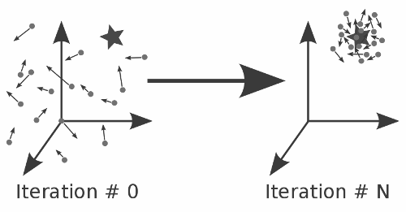
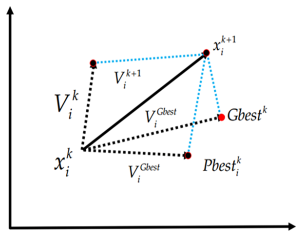

# tth-bdt-hyperparameter-optimization [](https://github.com/HEP-KBFI/tth-bdt-hyperparameter-optimization)
Evolutionary algorithms for hyperparameter optimization for BDT (XGBoost) and NN (with MNIST numbers dataset for testing).


## Installation

If running with CMSSW:

````console
git clone https://github.com/HEP-KBFI/tth-bdt-hyperparameter-optimization.git $CMSSW_BASE/src/tthAnalysis/bdtHyperparameterOptimization
pip install pathlib --user
pip install timeout-decorator --user
pip install docopt --user
````


## Particle Swarm Optimization (PSO)





Calculating the speed for next iteration:


c1 = c2 for balancing exploration and exploitation


Calculating the position for the next iteration:


### MNIST numbers dataset

Available here:
[Mnist numbers dataset](http://yann.lecun.com/exdb/mnist/)


